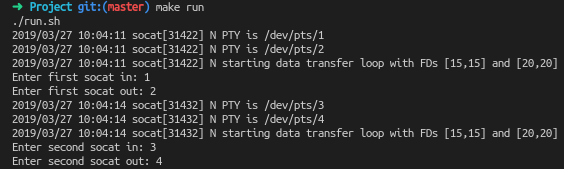

# Building/Compiling

* Recursively clone the repository to include all submodules.
    * A recursive call is required because the SINF simulators/aplications are required and a external JSON parsing library is used.
* Run `$ make` in the terminal to compile. (The Makefile is using 'clang' to compile the program, therefore clang can be considered a dependency)

# Running the project
* Option 1:
    * Run `$ make run` to run the project. This will start all necessary socat instances and simulators.
        * Example:

        

        * **Warning:** All dependencies of the simulators must be installed in the python environment that is used when the command: `$python <something.py>` is run.
    
    * Option 2:
        
        * Run `$GAS.out GASConfig.json <input-stream> <output-stream>` and all the other components separately.