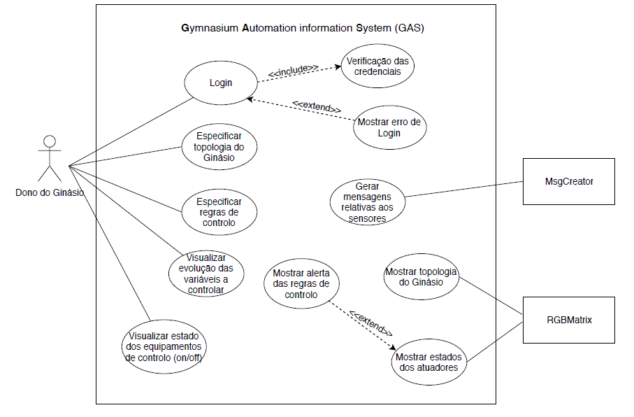

Specify Gym topology:
* As a User, I want to be able to specify a custom Gym topology to fit my needs.

Specify control rules:
* As a User, I want to be able to specify rules for control of actuators in the Gym.

Visualize variables/states:
* As a User, I want to be able to visualize the state of sensors/actuators on the property.

Parse messages from nodes:
* Be able to parse messages from nodes.

Display Gym topology:
* As a User, I want to be able to visualize the defined gym topology